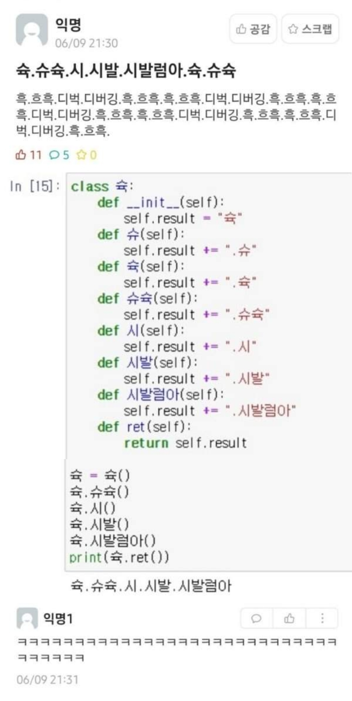

# s.ss.generator
슉.슈슉.슉. ... 와 같은 텍스트를 입력하면 그 텍스트를 생성하는 파이썬 코드를 생성하는 함수 코드입니다.

### 소스 파일
ss.s.generator.py 가 전부입니다. 이 readme 파일 하단에도 붙여넣어 두었습니다.

### 사용 방법
텍스트 string을 `writeCode(src)` 함수의 인수로 넣으면 코드가 출력됩니다.

- Input: string (ex. "슉.슈슉.시.시발.시발럼아.슉.슈슉")
- Output: string

### 입력 조건
- 입력 텍스트는 온점(.)으로 나뉘어 있어야 합니다.
- 입력 텍스트 중간중간에 공백( )이 있는 것은 괜찮습니다. 코드에서 감안합니다.
- 입력 텍스트의 처음에 온점(.)이 오면 __안됩니다.__
- 입력 텍스트의 끝에는 온점(.)이 와도 되지만, 대신 출력 코드가 출력하는 텍스트의 끝(온점 다음)에 공백( )이 하나 붙습니다.

### 입력 예시

    writeCode("슉.슈슉.시.시발.시발럼아.슉.슈슉")

    writeCode("흑.흐흑.디벅.디버깅.흑.흐흑.흑.흐흑.디벅.디버깅.흑.흐흑.흑.흐흑.디벅.디버깅.흑.흐흑.흑.흐흑.디벅.디버깅.흑.흐흑.흑.흐흑.디벅.디버깅.흑.흐흑.")

    writeCode("슈슉.슉.시.시발럼아.슈숙.시.시.시발럼아.슈슉 슈숙.슉.시.시발럼아.슈숙.시.시.시발롬아.슈슉 슈숙.슉.시.시발럼아.슈숙.시.시.시발럼아.슈슉 슈숙.슉.시.시발럼아.슈숙.시.시.시발롬아.슈슉 슈숙.슉.시.시발럼아.슈숙.시.시.시발럼아.슈슉")

### 예제
텍스트 src = "슈슉.슉.시.시발럼아.슈숙.시.시.시발럼아.슈슉 슈숙.슉.시.시발럼아.슈숙.시.시.시발롬아.슈슉 슈숙.슉.시.시발럼아.슈숙.시.시.시발럼아.슈슉 슈숙.슉.시.시발럼아.슈숙.시.시.시발롬아.슈슉 슈숙.슉.시.시발럼아.슈숙.시.시.시발럼아.슈슉" 가 주어지면, `WriteCode(src)`를 실행시켜 다음과 같은 코드를 얻습니다:
<pre>
<code>
>>> WriteCode("슈슉.슉.시.시발럼아.슈숙.시.시.시발럼아.슈슉 슈숙.슉.시.시발럼아.슈숙.시.시.시발롬아.슈슉 슈숙.슉.시.시발럼아.슈숙.시.시.시발럼아.슈슉 슈숙.슉.시.시발럼아.슈숙.시.시.시발롬아.슈슉 슈숙.슉.시.시발럼아.슈숙.시.시.시발럼아.슈슉")

[실행 결과]
class 슈슉:
    def __init__(self):
        self.result = "슈슉"
    def 슉(self):
        self.result += ".슉"
    def 시(self):
        self.result += ".시"
    def 시발럼아(self):
        self.result += ".시발럼아"
    def 슈숙(self):
        self.result += ".슈숙"
    def 슈슉_슈숙(self):
        self.result += ".슈슉 슈숙"
    def 시발롬아(self):
        self.result += ".시발롬아"
    def 슈슉(self):
        self.result += ".슈슉"
    def ret(self):
        return self.result

슈슉 = 슈슉()
슈슉.슉()
슈슉.시()
슈슉.시발럼아()
슈슉.슈숙()
슈슉.시()
슈슉.시()
슈슉.시발럼아()
슈슉.슈슉_슈숙()
슈슉.슉()
슈슉.시()
슈슉.시발럼아()
슈슉.슈숙()
슈슉.시()
슈슉.시()
슈슉.시발롬아()
슈슉.슈슉_슈숙()
슈슉.슉()
슈슉.시()
슈슉.시발럼아()
슈슉.슈숙()
슈슉.시()
슈슉.시()
슈슉.시발럼아()
슈슉.슈슉_슈숙()
슈슉.슉()
슈슉.시()
슈슉.시발럼아()
슈슉.슈숙()
슈슉.시()
슈슉.시()
슈슉.시발롬아()
슈슉.슈슉_슈숙()
슈슉.슉()
슈슉.시()
슈슉.시발럼아()
슈슉.슈숙()
슈슉.시()
슈슉.시()
슈슉.시발럼아()
슈슉.슈슉()
print(슈슉.ret())
</code>
</pre>
이 코드를 복사하여 각자 python 편집기에 붙여넣은 후 실행시켜 보면 결과를 얻을 수 있습니다. 

혹은 https://ideone.com/ 와 같은 온라인 코드 편집기에서도 실행시켜볼 수 있습니다.

### 모티브

### 소스 코드
<pre>
def writeInit(word):
    word = word.replace("_", " ")
    res = "    def __init__(self):\n"
    res += "        self.result = \"" + word + '"\n'
    return res

def writeFunction(word):
    word_s = word.replace("_", " ")
    res = "    def "+word+"(self):\n        self.result += \"." 
    res += word_s + "\"\n"
    return res

def writeClass(lst):
    class_name = lst[0]
    res = "class " + class_name + ":\n"
    res += writeInit(class_name)
    mod_lst = list(dict.fromkeys(lst[1:]))    # order preserving
    for word in mod_lst:
        res += writeFunction(word)
    res += "    def ret(self):\n"
    res += "        return self.result"
    return res

def writeMain(lst):
    class_name = lst[0]
    res = class_name + " = " + class_name + "()\n"
    for word in lst[1:]:
        res += class_name + "." + word + "()\n"
    res += "print(" + class_name + ".ret())"
    return res

def writeCode(src):
    wordlist = src.replace(" ", "_")
    wordlist = wordlist.split(".")
    res = ""
    res += writeClass(wordlist)
    res += "\n\n"
    res += writeMain(wordlist)
    return res

if __name__ == "__main__":
    print(writeCode("슈슉.슉.시.시발럼아.슈숙.시.시.시발럼아.슈슉 슈숙.슉.시.시발럼아.슈숙.시.시.시발롬아.슈슉 슈숙.슉.시.시발럼아.슈숙.시.시.시발럼아.슈슉 슈숙.슉.시.시발럼아.슈숙.시.시.시발롬아.슈슉 슈숙.슉.시.시발럼아.슈숙.시.시.시발럼아.슈슉"))
<code>
